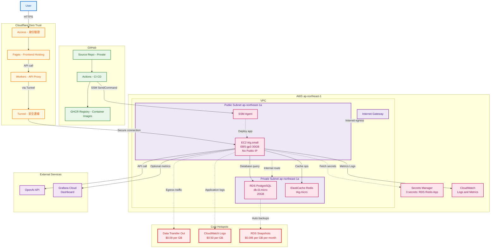

# rag-qa-bot-iac

Terraform Code for infrastructure of rag-qa-bot.

## 目錄結構

```yaml
iac-demo/
├── versions.tf
├── providers.tf
├── variables.tf
├── outputs.tf
├── network.vpc.tf          # Default VPC + 子網/路由/IGW（單 AZ）
├── security_groups.tf      # EC2/RDS/Redis SG
├── ec2.app.tf              # EC2（公有子網、無公網 IP、EBS gp3 30GB、SSM）
├── rds.postgres.tf         # RDS PostgreSQL（私有子網、Free Tier）
├── redis.elasticache.tf    # ElastiCache Redis（私有子網、Free Tier）
├── secrets.rds.tf          # Secrets Manager：RDS 用
├── secrets.redis.tf        # Secrets Manager：ElastiCache 用
└── secrets.app.tf          # Secrets Manager：後端應用用
```

## Infra 架構圖 (TODO 內容待修)



## 執行步驟

```bash
aws configure --profile demo
AWS Access Key ID [None]: <你的 IAM 使用者 Access Key>
AWS Secret Access Key [None]: <你的 IAM 使用者 Secret Key>
Default region name [None]: ap-northeast-1
Default output format [None]: json
```

```hcl
# 設定 profile
provider "aws" {
  region  = "ap-northeast-1"
  profile = "demo"
}

# 跑 tf
terraform init

terraform validate

terraform plan
```
