# rag-qa-bot-iac

Terraform Code for infrastructure of rag-qa-bot.

## 目錄結構

```yaml
iac-demo/
├── versions.tf
├── providers.tf
├── variables.tf
├── outputs.tf
├── network.vpc.tf          # Default VPC + 子網/路由/IGW（單 AZ）
├── security_groups.tf      # EC2/RDS/Redis SG
├── ec2.app.tf              # EC2（公有子網、無公網 IP、EBS gp3 30GB、SSM）
├── rds.postgres.tf         # RDS PostgreSQL（私有子網、Free Tier）
├── redis.elasticache.tf    # ElastiCache Redis（私有子網、Free Tier）
├── secrets.rds.tf          # Secrets Manager：RDS 用
├── secrets.redis.tf        # Secrets Manager：ElastiCache 用
└── secrets.app.tf          # Secrets Manager：後端應用用
```

## Infra 架構圖

```mermaid
%%{init: {
  "flowchart": { "htmlLabels": true, "padding": 12, "nodeSpacing": 30, "rankSpacing": 40 },
  "themeVariables": { "fontSize": "16px", "lineHeight": "1.3" }
}}%%
flowchart TB
  U((👤 本機開發者))

  subgraph AWS["AWS ap-northeast-1"]
    direction TB

    subgraph VPC["VPC (default)"]
      IGW["Internet Gateway"]

      subgraph PUB["Public Subnet (1a)"]
        APP["EC2 t4g.medium<br/>EBS gp3 30 GiB (Free Tier)<br/>Public IP 綁定（EIP）"]
        SSMNODE["SSM Agent"]
      end

      subgraph PRI_A["Private Subnet A (1a)"]
        REDIS["ElastiCache Redis 7.0<br/>cache.t3.micro ($0.0208/hr)"]
      end
    end

    SM["Secrets Manager<br/>2–3 secrets（$0.40/secret/月）"]
    PARAM["SSM Parameter Store（標準）<br/>Always Free"]
    S3["Amazon S3<br/>5 GB（Free Tier, 12 個月）"]
    CW["CloudWatch Metrics<br/>(Free)"]
  end

  APP --> |Cache ops| REDIS
  APP -.-> |讀取機密| SM
  APP -.-> |讀取設定/參數| PARAM
  APP --> |讀/寫索引與小檔| S3
  APP --> |Service metrics| CW

  IGW --- |Internet egress| PUB
  PUB -.-> |Internal route| PRI_A

  %% 使用者連線（兩行，避免 parser 合併）
  U -.-> |Session Manager via SSM| SSMNODE
  SSMNODE --> APP

  subgraph COSTS["Cost Hotspots"]
    DTO["Data Transfer Out<br/>$0.12 per GB（>100GB/月 部分）"]
  end

  APP -.-> |回應外部用戶流量| DTO

  classDef aws           fill:#F5F5F5,stroke:#0072B2,stroke-width:2px,color:#003865
  classDef service_ec2   fill:#E7F3FD,stroke:#0072B2,stroke-width:2px,color:#003865
  classDef service_redis fill:#FFF3D6,stroke:#E69F00,stroke-width:2px,color:#8A5A00
  classDef service_misc  fill:#FBE5F1,stroke:#CC79A7,stroke-width:2px,color:#7A1B60
  classDef cost          fill:#FDE2D5,stroke:#D55E00,stroke-width:3px,color:#7A2E00
  classDef user          fill:#FFFFFF,stroke:#000000,stroke-width:2px,color:#000000

  class VPC,IGW,PUB,PRI_A aws
  class APP service_ec2
  class SSMNODE,SM,PARAM,S3,CW service_misc
  class REDIS service_redis
  class DTO cost
  class U user

  style AWS fill:#FAFAFA,stroke:#0072B2,stroke-width:2px,color:#003865
```



## 執行步驟

```bash
aws configure --profile demo
AWS Access Key ID [None]: <你的 IAM 使用者 Access Key>
AWS Secret Access Key [None]: <你的 IAM 使用者 Secret Key>
Default region name [None]: ap-northeast-1
Default output format [None]: json
```

```hcl
# 設定 profile
provider "aws" {
  region  = "ap-northeast-1"
  profile = "demo"
}

# 跑 tf
terraform init

terraform validate

terraform plan
```
